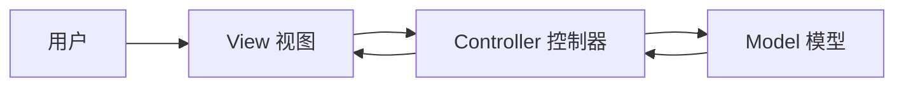
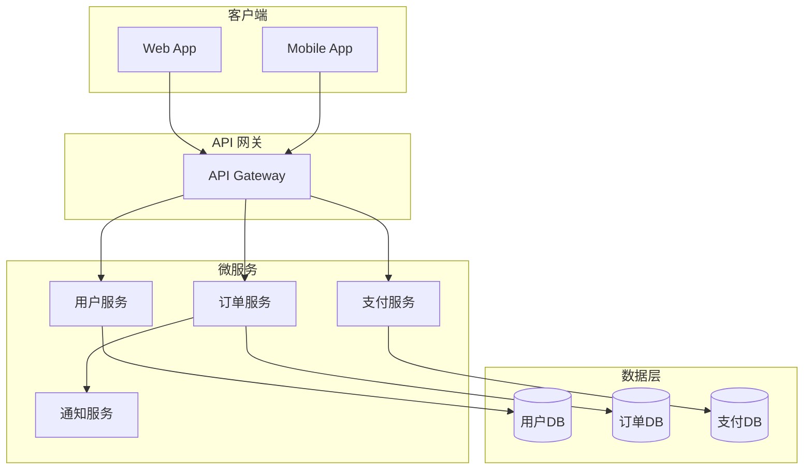
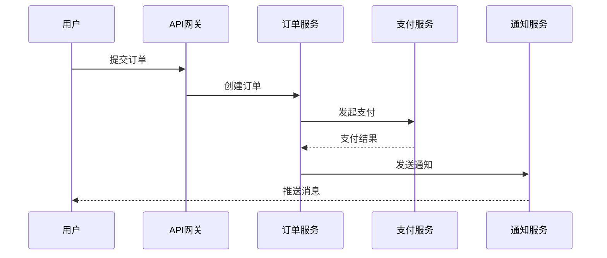
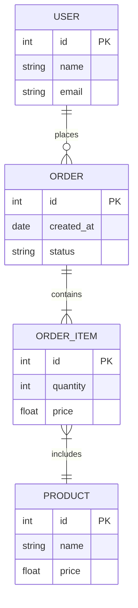
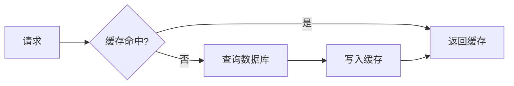
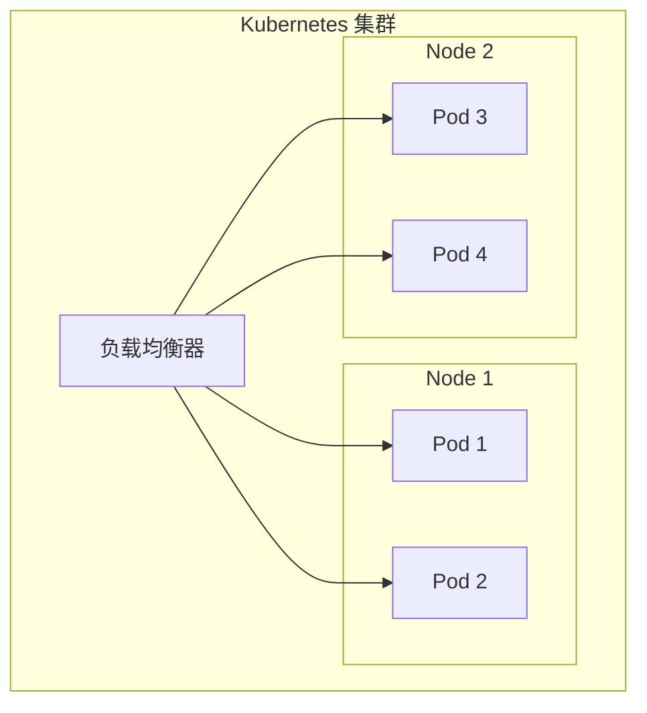
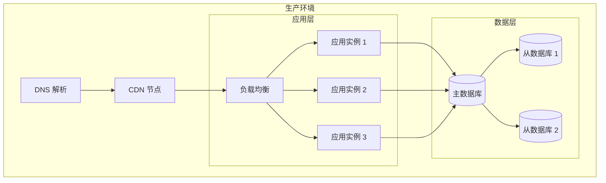
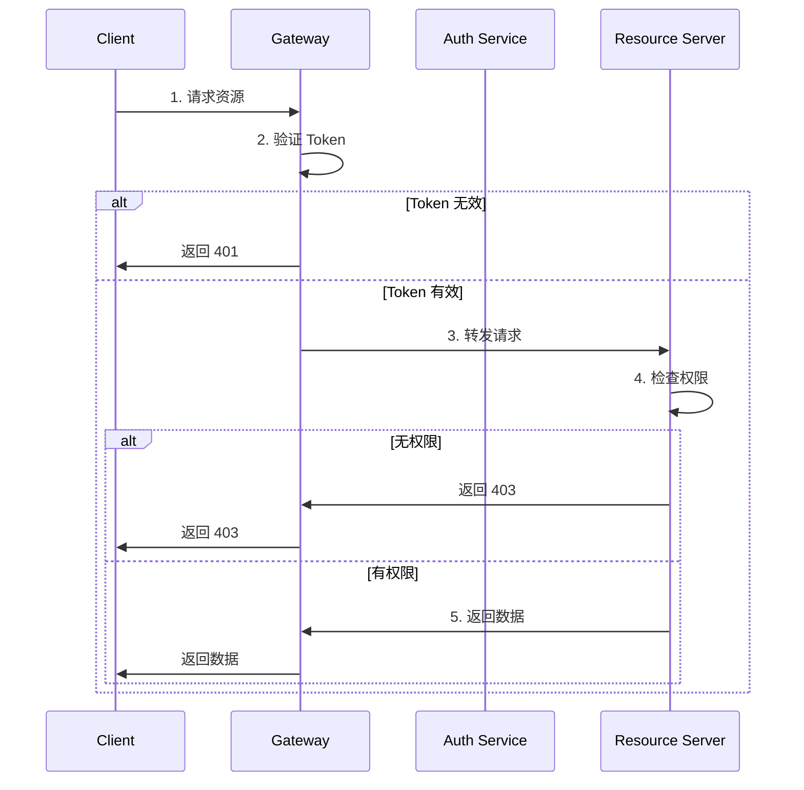

## 概述

本文档介绍系统架构设计的核心概念和最佳实践。

### 架构定义

软件架构是指软件系统的高层结构，包括：

- 组件及其关系
- 系统设计原则
- 技术选型依据

#### 什么是好的架构

好的架构应具备以下特征：

1. **可维护性** - 易于理解和修改
2. **可扩展性** - 支持功能扩展
3. **可测试性** - 便于单元测试和集成测试
4. **高性能** - 满足性能要求

## 架构模式

### MVC 模式

MVC（Model-View-Controller）是最经典的架构模式：

#### MVC 的优点

- 关注点分离
- 代码复用
- 并行开发

#### MVC 的缺点

- 复杂度增加
- 学习曲线

### 微服务架构

微服务架构将应用拆分为多个小型服务：

#### 服务拆分原则

按业务能力拆分：

| 服务 | 职责 | 技术栈 |
|------|------|--------|
| 用户服务 | 用户管理、认证 | Node.js |
| 订单服务 | 订单处理 | Go |
| 支付服务 | 支付流程 | Java |

#### 服务通信

## 数据架构

### 数据库选型

#### 关系型数据库

适用于事务处理场景：

#### NoSQL 数据库

适用于大规模数据场景：

| 类型 | 代表 | 适用场景 |
|------|------|----------|
| 文档型 | MongoDB | 内容管理、日志 |
| 键值型 | Redis | 缓存、会话 |
| 图数据库 | Neo4j | 社交网络、推荐 |
| 列存储 | Cassandra | 时序数据、IoT |

### 缓存策略

#### 缓存模式

1. **Cache-Aside**：应用层管理缓存
2. **Read-Through**：缓存层自动读取
3. **Write-Through**：同步写入缓存和数据库
4. **Write-Behind**：异步写入数据库

## 部署架构

### 容器化部署

使用 Docker 和 Kubernetes 进行容器编排：

#### Kubernetes 核心概念

- **Pod**：最小部署单元
- **Service**：服务发现和负载均衡
- **Deployment**：声明式更新
- **ConfigMap**：配置管理
- **Secret**：敏感信息存储

### 高可用架构

## 安全架构

### 认证授权流程

### 安全最佳实践

#### API 安全

- 使用 HTTPS 加密传输
- 实现 Rate Limiting
- 输入验证和过滤
- JWT Token 管理

#### 数据安全

- 敏感数据加密存储
- 数据库访问控制
- 审计日志记录

## 总结

良好的架构设计是系统成功的基础。选择合适的架构模式，结合业务需求进行权衡，才能构建出高质量的软件系统。
