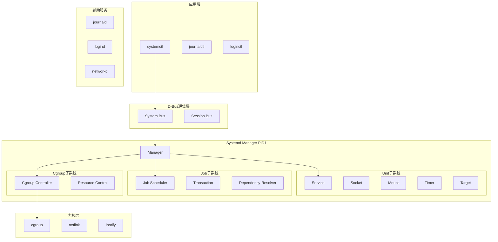
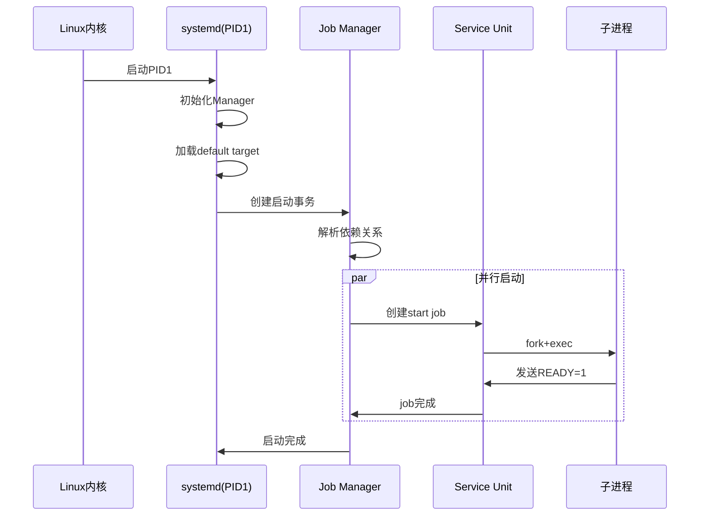
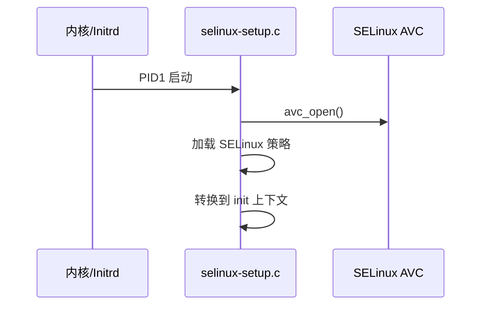

Systemd 是现代 Linux 系统的核心组件，作为 PID 1 进程负责系统和服务管理。本文从架构角度深入分析其设计原理。

## 项目概述

Systemd 采用并行启动、依赖管理等技术，显著提高了系统启动速度。主要特性包括：

- **并行启动**：基于依赖关系的并行化启动
- **按需启动**：通过 socket 激活机制实现服务按需启动
- **统一日志**：集中式日志管理（journald）
- **资源管理**：基于 cgroup 的资源控制和限制
- **安全机制**：支持 SELinux、AppArmor、IMA/EVM

## 整体架构

### 系统层次结构



## 核心组件

### Manager（管理器）

Manager 是 systemd 的核心协调器，负责：
- 管理所有 Unit 的生命周期
- 协调 Job 的执行
- 处理系统事件和信号
- 维护系统状态

**源码位置**：`src/core/manager.h`，`src/core/manager.c`

### Unit（单元）

Unit 是 systemd 中的基本管理对象：

| 类型 | 说明 |
|------|------|
| Service | 守护进程服务 |
| Socket | IPC 通信端点 |
| Device | 内核设备 |
| Mount | 文件系统挂载点 |
| Timer | 定时触发器 |
| Target | 同步点（类似 runlevel） |
| Slice | 资源分配切片 |
| Scope | 外部创建的进程组 |

**源码位置**：`src/core/unit.h`，`src/core/unit.c`

### Job（作业）

Job 代表对 Unit 执行的操作请求：
- START / STOP / RELOAD / RESTART / VERIFY_ACTIVE

**源码位置**：`src/core/job.h`，`src/core/job.c`

### Cgroup（控制组）

Cgroup 子系统负责：
- 资源限制（CPU、内存、IO）
- 进程分组与性能监控
- OOM 管理

## 启动流程交互



## 源码目录结构

```
systemd/
├── src/
│   ├── core/           # systemd 核心（PID 1）
│   │   ├── manager.c   # 管理器
│   │   ├── unit.c      # 单元抽象
│   │   ├── job.c       # 作业调度
│   │   ├── service.c   # 服务单元
│   │   └── cgroup.c    # 控制组
│   ├── basic/          # 基础工具函数库
│   ├── shared/         # 共享代码
│   └── libsystemd/     # 共享库
│       ├── sd-bus/     # D-Bus 客户端库
│       ├── sd-event/   # 事件循环库
│       ├── sd-journal/ # 日志库
│       └── sd-login/   # 登录会话库
├── units/              # 系统单元文件
└── man/                # 手册页
```

## 安全模块支持

Systemd 深度集成多种 Linux 安全模块：

### 1. SELinux 支持

**初始化流程**：



**单元文件配置**：

```ini
[Service]
SELinuxContext=system_u:system_r:httpd_t:s0
```

### 2. AppArmor 支持

```ini
[Service]
AppArmorProfile=/etc/apparmor.d/usr.sbin.nginx
```

### 3. Seccomp 支持

```ini
[Service]
SystemCallFilter=@system-service
SystemCallErrorNumber=EPERM
SystemCallArchitectures=native
```

### 4. IMA/EVM 支持

Systemd 在启动初期加载 IMA 策略：

```c
// src/core/ima-setup.c
#define IMA_SECFS_POLICY "/sys/kernel/security/ima/policy"
#define IMA_POLICY_PATH  "/etc/ima/ima-policy"
```

### 综合安全配置示例

```ini
[Service]
User=nginx
Group=nginx

# SELinux/AppArmor
SELinuxContext=system_u:system_r:httpd_t:s0

# Seccomp
SystemCallFilter=@system-service
SystemCallErrorNumber=EPERM

# Capabilities
CapabilityBoundingSet=CAP_NET_BIND_SERVICE
CapabilityBoundingSet=~CAP_SYS_ADMIN

# 命名空间隔离
NoNewPrivileges=true
PrivateTmp=true
PrivateDevices=true
ProtectSystem=strict
ProtectHome=yes

# 网络隔离
IPAddressAllow=127.0.0.1/32
IPAddressDeny=any
```

## 依赖系统

### 依赖类型

| 依赖类型 | 含义 | 行为 |
|---------|------|------|
| **Requires** | 强依赖 | 目标必须启动成功 |
| **Wants** | 弱依赖 | 目标失败不影响 |
| **Requisite** | 必需且已启动 | 目标必须已运行 |
| **BindsTo** | 绑定依赖 | 目标停止则自身停止 |
| **Conflicts** | 冲突 | 目标不能同时运行 |
| **Before/After** | 启动顺序 | 控制启动先后 |

## 开发指南

### 编译构建

Systemd 使用 Meson 构建：

```bash
# 安装依赖
sudo apt-get build-dep systemd

# 配置构建
mkdir build && cd build
meson setup .. -Dmode=developer -Dtests=true

# 编译
ninja

# 测试
ninja test
```

### 编码规范

```c
// 8 空格缩进
void some_function(int foo, bool bar) {
        int a, b;

        // 单行 if 不用花括号
        if (foobar)
                waldo();

        // 使用 _cleanup_ 自动清理
        _cleanup_free_ char *str = NULL;

        // 错误返回负错误码
        if (r < 0)
                return log_error_errno(r, "Failed: %m");
}
```

### 调试技巧

```bash
# 使用 mkosi 构建测试镜像
pip install mkosi
mkosi genkey
mkosi boot  # systemd-nspawn
mkosi qemu  # QEMU

# 调试用户服务
systemd-analyze verify /path/to/service
```

## 接口稳定性承诺

从版本 26 开始，systemd 承诺以下接口稳定：
- 单元配置文件格式
- 命令行接口（systemctl、journalctl 等）
- D-Bus 接口
- libsystemd 公共 API

## 总结

Systemd 通过清晰的层次架构实现：

1. **并行化**：依赖图驱动的并行启动
2. **按需激活**：socket/path/timer 等机制
3. **统一管理**：Unit 和 Job 抽象
4. **资源控制**：深度集成 cgroup
5. **安全集成**：SELinux/AppArmor/seccomp/IMA

对于开发者，严格的依赖层级和完善的测试框架确保代码质量；对于系统管理员，统一的接口和强大的资源控制能力提供了灵活的系统管理手段。
